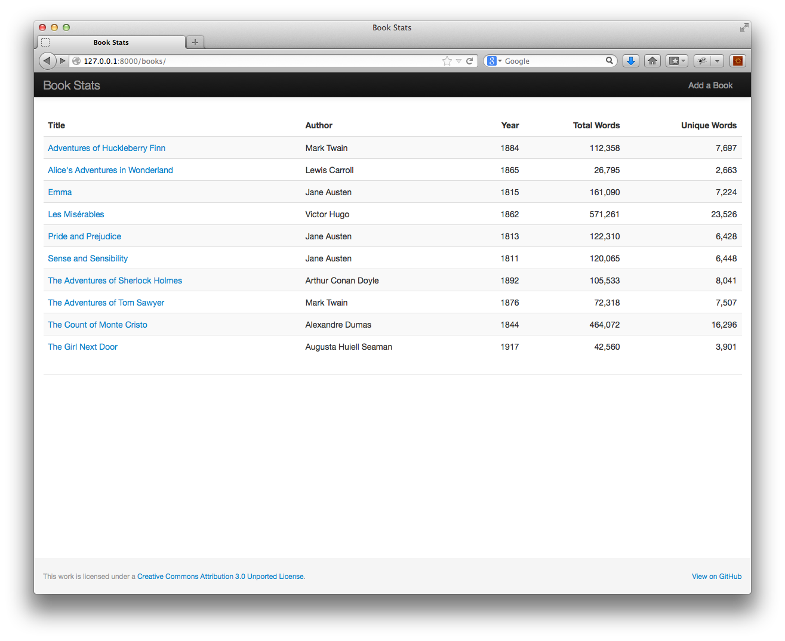
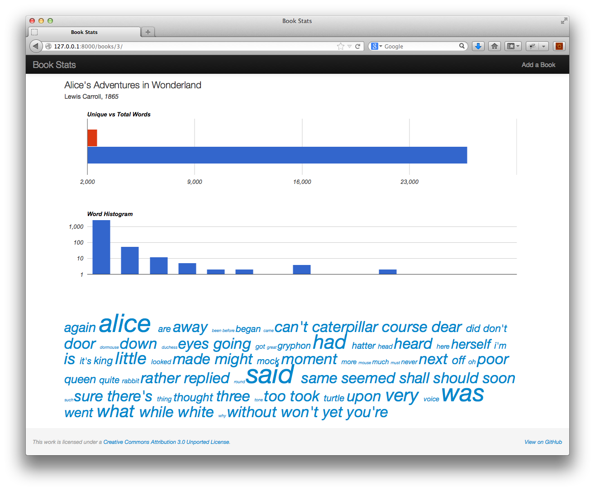
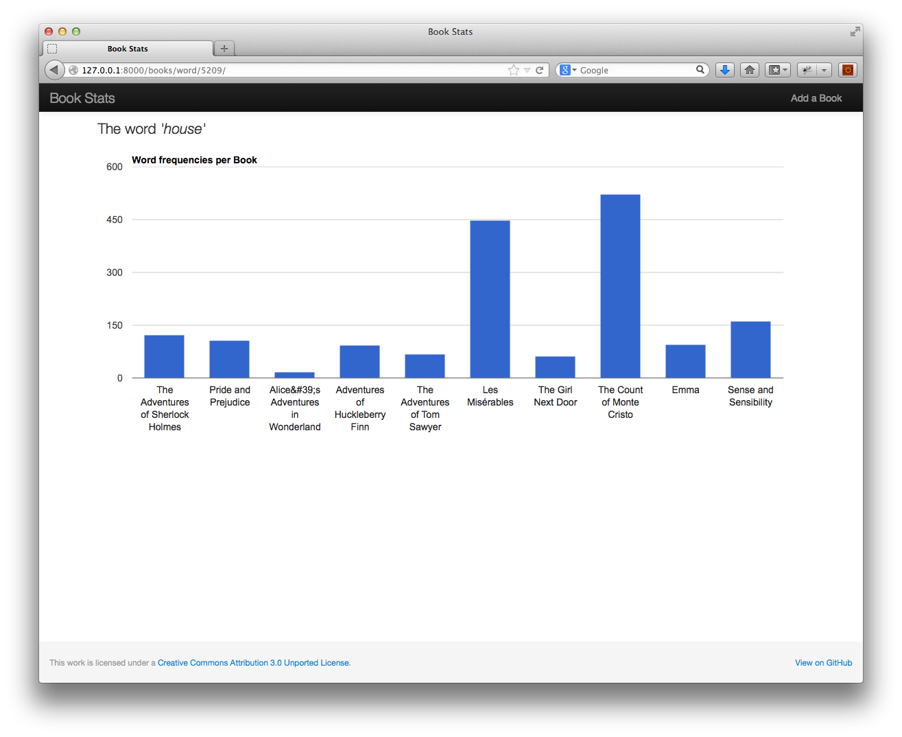

### Welcome to Stats
This is a small webapp I developed while learning Python and Django. Ebooks from [Project Gutenberg](http://www.gutenberg.org/) in TXT format are added to it and then it displays various statistics about that book along with comparison of words between all other books in the database.

### Screenshots

